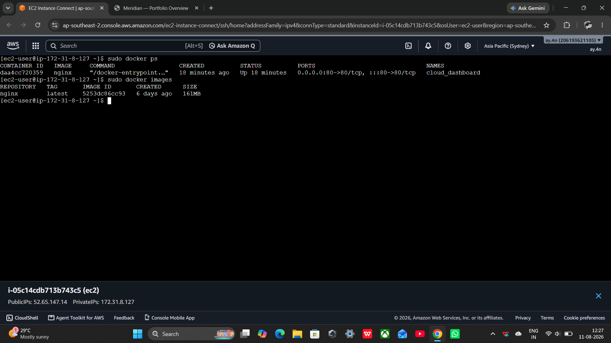
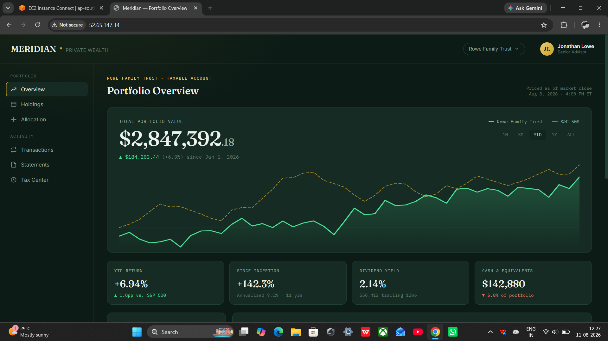

# Nginx Docker Portfolio Dashboard

[](https://aws.amazon.com/ec2/)
[](https://www.docker.com/)
[](https://nginx.org/)
[](https://github.com/)

A containerized portfolio dashboard deployed on an **AWS EC2 instance** using **Docker and Nginx**. This project demonstrates static web application deployment, Docker containerization, host-to-container port mapping, and cloud-based hosting through an EC2 public endpoint.

---

## 📌 Project Overview

This project demonstrates the deployment of a static HTML portfolio dashboard on an **AWS EC2 instance** using a **Docker container running Nginx**.

The application uses the official `nginx` Docker image to serve the `index.html` dashboard. The Nginx container listens on port `80`, which is mapped to port `80` of the EC2 host.

Once deployed, the dashboard can be accessed directly through the EC2 instance's public IP address or public DNS endpoint.

### Deployment Flow

```text
                         Internet
                            │
                            ▼
                  AWS EC2 Public Endpoint
                            │
                         Port 80
                            │
                            ▼
                ┌───────────────────────┐
                │    Docker Container   │
                │                       │
                │        Nginx          │
                │       Port 80         │
                │          │            │
                │          ▼            │
                │      index.html       │
                │                       │
                └───────────────────────┘
```

### Request Flow

```text
Browser
   │
   │ HTTP :80
   ▼
AWS EC2 Instance
   │
   │ Port Mapping: 80:80
   ▼
Docker Container
   │
   ▼
Nginx Web Server
   │
   ▼
index.html
```

## 🛠️ Technologies Used

| Technology | Purpose |
|------------|---------|
| AWS EC2    | Cloud infrastructure and application hosting |
| Docker     | Application containerization |
| Nginx      | Web server |
| HTML5      | Dashboard structure |
| CSS3       | Dashboard styling and responsive design |
| Git        | Version control |
| GitHub     | Source code and project documentation |

## 📁 Project Structure

```
nginx-docker-portfolio-dashboard/
│
├── index.html
├── README.md
└── screenshots/
    ├── ec2-terminal.png
    └── portfolio-dashboard.png
```

### File Description

| File | Description |
|------|--------------|
| index.html | Static portfolio dashboard application |
| ec2-terminal.png | Screenshot showing the EC2 terminal, running Docker container, and Nginx image |
| portfolio-dashboard.png | Screenshot showing the deployed dashboard through the EC2 public endpoint |
| README.md | Project documentation |

## 🐳 Docker Deployment

The application runs inside a Docker container named:

```
cloud_dashboard
```

The container uses the official Nginx image:

```
nginx:latest
```

The container exposes Nginx on port 80, which is mapped to port 80 on the EC2 host.

### Run the Nginx Container

```bash
sudo docker run -d \
  --name cloud_dashboard \
  -p 80:80 \
  nginx
```

### Port Mapping

```text
EC2 Host Port 80
       │
       ▼
Docker Container Port 80
       │
       ▼
      Nginx
       │
       ▼
  index.html
```

The Docker port mapping is:

```
Host Port : Container Port
     80    :      80
```

The `-p 80:80` option forwards HTTP traffic received on port 80 of the EC2 host to port 80 of the Nginx container.

## ⚙️ Deployment Process

### 1. Launch an AWS EC2 Instance

Create an EC2 instance and configure the security group to allow HTTP traffic.

Required inbound rule:

```
Type:        HTTP
Protocol:    TCP
Port:        80
Source:      0.0.0.0/0
```

SSH access should also be configured according to your environment.

### 2. Install Docker

Install Docker on the EC2 instance.

Verify the installation:

```bash
sudo docker --version
```

### 3. Pull the Nginx Image

```bash
sudo docker pull nginx
```

### 4. Run the Docker Container

```bash
sudo docker run -d \
  --name cloud_dashboard \
  -p 80:80 \
  nginx
```

This creates a detached Docker container named `cloud_dashboard` using the Nginx image.

### 5. Verify the Running Container

Check the running containers:

```bash
sudo docker ps
```

Expected port mapping:

```
0.0.0.0:80->80/tcp
```

The deployment uses:

```
Container Name : cloud_dashboard
Docker Image   : nginx
Container Port : 80
Host Port      : 80
Status         : Running
```

### 6. Deploy the HTML Dashboard

Copy the portfolio dashboard into the Nginx web root:

```bash
sudo docker cp index.html \
  cloud_dashboard:/usr/share/nginx/html/index.html
```

Nginx serves the website from:

```
/usr/share/nginx/html/
```

The main application file is:

```
index.html
```

### 7. Verify Docker Images

Check the available Docker images:

```bash
sudo docker images
```

The Nginx image should appear in the output.

### 8. Verify the Container

Check the container again:

```bash
sudo docker ps
```

The expected output should show the container running with:

```
0.0.0.0:80->80/tcp
```

This confirms that port 80 of the EC2 host is mapped to port 80 of the Docker container.

### 9. Access the Dashboard

Open the EC2 public IP address in a web browser:

```
http://<EC2-PUBLIC-IP>
```

Example:

```
http://52.xx.xx.xx
```

The application can also be accessed through the EC2 public DNS endpoint:

```
http://<EC2-PUBLIC-DNS>
```

### Complete Request Path

```text
EC2 Public Endpoint
        │
        ▼
EC2 Host Port 80
        │
        ▼
Docker Container Port 80
        │
        ▼
Nginx
        │
        ▼
/usr/share/nginx/html/index.html
        │
        ▼
Portfolio Dashboard
```

## 📸 Deployment Screenshots

### EC2 Terminal — Docker Deployment

The following screenshot shows the AWS EC2 Instance Connect terminal with the running `cloud_dashboard` Docker container and the Nginx image.



**Verified Deployment Details**

```
Container Name : cloud_dashboard
Docker Image   : nginx
Container Port : 80
Host Port      : 80
Status         : Running
```

### Portfolio Dashboard — EC2 Endpoint

The following screenshot shows the portfolio dashboard successfully served through the AWS EC2 public endpoint.



## 🎨 Dashboard Features

The portfolio dashboard provides a modern portfolio-management interface featuring:

- Portfolio overview
- Total portfolio value
- YTD return
- Performance comparison
- Dividend yield
- Cash and equivalents
- Asset allocation
- Holdings information
- Watchlist
- Responsive layout
- Modern dark-themed interface
- Mobile-friendly styling

The application is implemented as a static HTML dashboard and is served directly through the Nginx web server.

## ☁️ AWS Infrastructure

The project uses the following AWS infrastructure:

```text
AWS Cloud
│
└── EC2 Instance
    │
    ├── Security Group
    │      └── HTTP :80
    │
    └── Docker
           │
           └── cloud_dashboard
                  │
                  └── nginx:latest
                         │
                         └── /usr/share/nginx/html/
                                │
                                └── index.html
```

## 🔍 Docker Management & Verification

### Check Running Containers

```bash
sudo docker ps
```

### Check All Containers

```bash
sudo docker ps -a
```

### Check Docker Images

```bash
sudo docker images
```

### View Container Logs

```bash
sudo docker logs cloud_dashboard
```

### Inspect Container Configuration

```bash
sudo docker inspect cloud_dashboard
```

### Stop the Container

```bash
sudo docker stop cloud_dashboard
```

### Start the Container

```bash
sudo docker start cloud_dashboard
```

### Restart the Container

```bash
sudo docker restart cloud_dashboard
```

## 🔐 Security Considerations

This project is intended as a cloud and DevOps deployment demonstration.

For a production environment, the following security improvements are recommended:

- Enable HTTPS using an SSL/TLS certificate
- Use a custom domain name
- Restrict SSH access to trusted IP addresses
- Avoid exposing unnecessary ports
- Keep Docker and the EC2 operating system updated
- Use AWS IAM roles instead of storing credentials
- Consider using an Application Load Balancer
- Implement monitoring and logging using Amazon CloudWatch
- Follow the principle of least privilege for AWS resources

## 📈 Future Improvements

Potential improvements for this project include:

- [ ] Create a custom Dockerfile
- [ ] Add Docker Compose
- [ ] Configure HTTPS
- [ ] Add a custom domain using Route 53
- [ ] Implement GitHub Actions CI/CD
- [ ] Add AWS CloudWatch monitoring
- [ ] Deploy behind an Application Load Balancer
- [ ] Add automated Docker image builds
- [ ] Convert the static dashboard into a dynamic application
- [ ] Add a backend API and database
- [ ] Implement automated deployment from GitHub

## 📚 Key Learning Outcomes

This project demonstrates practical experience with:

- AWS EC2
- Docker containerization
- Nginx web server
- Docker port mapping
- Linux server administration
- Static website deployment
- Cloud-based application hosting
- EC2 security groups
- Git and GitHub
- Basic DevOps deployment practices

## 👨‍💻 Author

**Md Ayan Ahmed**
B.Tech Computer Science & Engineering
Cloud & DevOps Enthusiast

## ⭐ Support

If you found this project useful or informative, consider giving the repository a ⭐ on GitHub.
